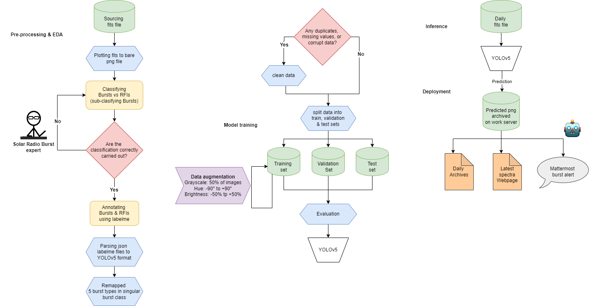

# **Object detection of Solar Radio Bursts** 

**by Akhil Gunessee**

[*Type III solar radio bursts being detected by the model*]

# **Goal**
Improving the current non-AI detection of solar radio bursts through a deep learning, object detection approach. YOLOv5 was selected for that matter.

# **Background**
Solar radio bursts are short periods during which the Sun's radio emission is elevated above the background level. They are signatures of the same underlying physical processes that lead to the more widely-known forms of solar activity such as sunspots, solar flares, and coronal mass ejections (CMEs).

Solar radio bursts are classified pincipally on their appearance in a dynamic spectrum from radiospectrographs, that is primarily on how a burst's frequency drifts over time. There are five main types of solar radio bursts, namely types I to V. 

# **Motivation**
Measuring solar activity through radio observations is a key indicator for monitoring and prediciting space weather. The main advantage of ground-based radio observations over optical ones of the Sun is that the former is unaffected by clouded skies. Keeping an eye on space weather is essential since it can have dire consequences on the state of our satellites (communication, navigation, ...), astronaut safety, airline travellers safety, electrical grid, and other electrical/electronic dependent systems which have become ubiqutous in today's digital era.

# **Datasets**
The data can be found on the Humain archives of Royal Observatory of Belgium (ROB), Solar Influences Data Analysis Center's (SIDC) [webpage](https://wwwbis.sidc.be/humain/callisto_archives).

# Annotation done using Labelme tool

The output of the bounding boxes of the corresponding classes is in JSON format.

# **Methodology**

# **Deployment**
The code for deployment will not be shown due to security reasons and IP issues related to work.

The deployed model running a prediction about every minutes can be found here:

https://wwwbis.sidc.be/humain/callisto_ml_burst

In the above webpage, the latest prediction of both the YOLOv5 object detection and the interquartile range (IQR) threshold are displayed for comparison purposes.

The archives of the detected bursts through object detection can be found here (produced as from the 1st of May 2022):

https://wwwbis.sidc.be/humain/callisto_ml_burst_archives

The Mattermost burst notification channel is not available since it is used for internal communication at work.

# **Future works**
* Sourcing more data spanning whole operational lifetime of instrument
* Address potential under-representation of certain classes through synthetic spectras
* Hyperparameter fine tuning
* Ensemble model (>= 2 AIs, or 1 AI with 1 non-AI)
* Unsupervised clustering

# **References**
1.   https://colab.research.google.com/github/roboflow-ai/yolov5-custom-training-tutorial/blob/main/yolov5-custom-training.ipynb
2.   https://blog.roboflow.com/how-to-train-yolov5-on-a-custom-dataset/
